# RealTourFlow UAT — Based on What's Actually Built

> **How to use:** Open in VS Code → `Cmd+Shift+V` to render diagrams.
> Use the **RoleSwitcher** toolbar (bottom-left, fixed position) to flip between personas.
> All data is mock — state lives in Zustand stores (in-memory, resets on page refresh).

---

## Mock Users Quick Reference

| User | Role | URL on switch | Deal(s) | Stage |
|------|------|--------------|---------|-------|
| Sarah Johnson (`agent-sarah`) | Agent | `/agent` | All 6 | — |
| Paul Leara (`admin-paul`) | Admin | `/admin` | All 6 | — |
| Mike Smith (`buyer-smith`) | Buyer | `/buyer/buyer-smith` | deal-smith | Under Contract |
| Alex Garcia (`buyer-garcia`) | Buyer | `/buyer/buyer-garcia` | deal-garcia | Active Search |
| Kevin Chen (`buyer-chen`) | Buyer | `/buyer/buyer-chen` | deal-chen | Intake |
| Chris Davis (`buyer-davis`) | Buyer | `/buyer/buyer-davis` | deal-davis | Intake |
| Jennifer Williams (`seller-williams`) | Seller | `/seller/seller-williams` | deal-williams | Under Contract |
| Robert Johnson (`seller-johnson`) | Seller | `/seller/seller-johnson` | deal-johnson | Offer Active |
| Jamie Taylor (`tc-taylor`) | TC | `/tc` | deal-smith + deal-williams | — |

---

## Known Stubs (built UI, action not yet wired)

| Location | Stub |
|----------|------|
| All message input fields | Text input + send button visible — does not actually send |
| Seller: Accept / Counter / Decline offer buttons | Buttons render — no state change wired |
| Settings → Integrations | DocuSign / Google Calendar / Outlook show "Connect" — no flow |
| Admin: Metro View, Promotions, Config sections | "Coming Soon" page |
| `/agent/messages`, `/agent/calendar`, `/agent/documents` | "Coming Soon" pages |
| Fast Pass checkout | Stripe not integrated — confirm button has no payment flow |

---

## 1. RoleSwitcher — How It Works

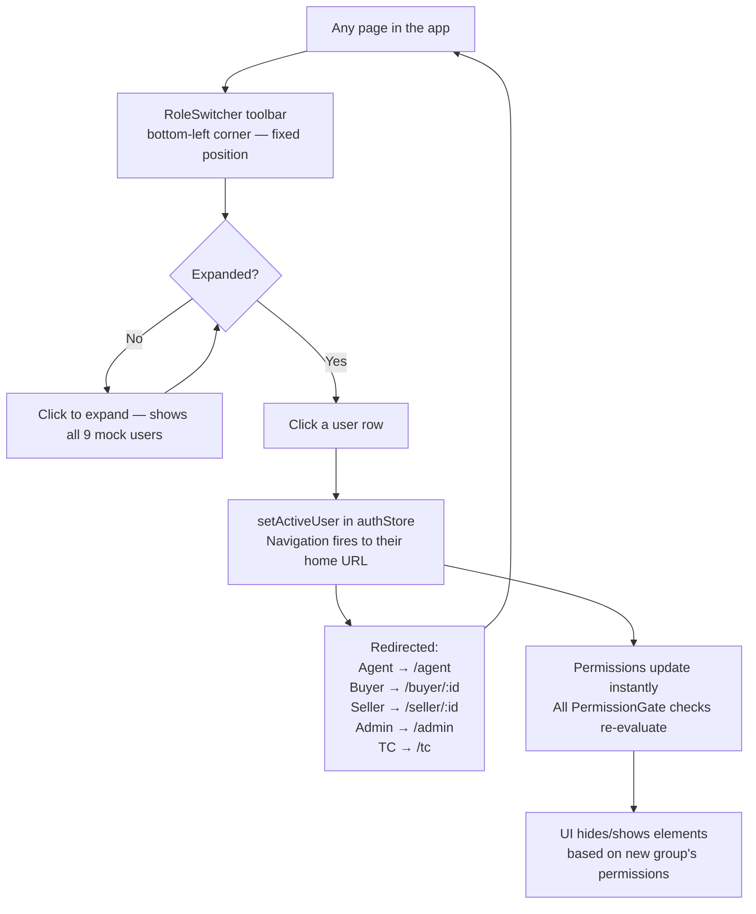

---

## 2. Agent — Sarah Johnson

### 2A. Dashboard (`/agent`)

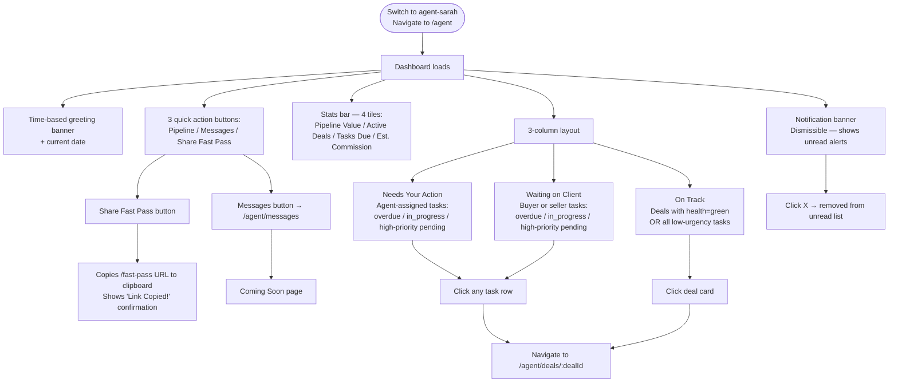

### 2B. Pipeline (`/agent/pipeline`)

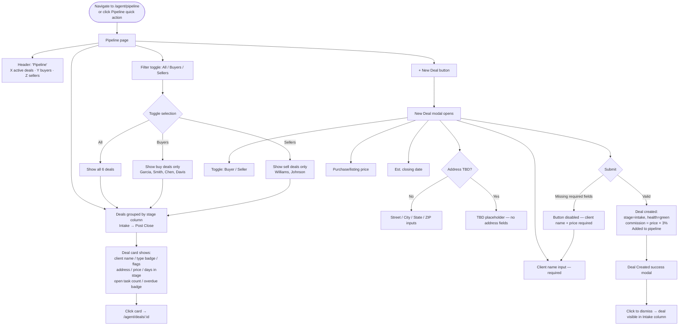

### 2C. Deal Detail (`/agent/deals/:dealId`)

```mermaid
flowchart TD
    START([Navigate to /agent/deals/:dealId]) --> HEADER_DD[Header:\nclient name / property address / stage badge\nhealth indicator / closing date / commission]

    HEADER_DD --> STAGE_ADV[Stage advance control\nadvance button or dropdown]
    STAGE_ADV --> ADV_RESULT{Advance stage}
    ADV_RESULT -->|Clicked| STAGE_UPDATED[Deal stage updated in dealStageStore\nClient views update immediately]

    HEADER_DD --> TAB_BAR[Tab bar: Tasks · Messages · Documents\nwith live counts on Tasks and Messages]
    HEADER_DD --> OVERVIEW_SEC[Overview section — always visible above tabs]

    OVERVIEW_SEC --> LOAN_CARD[Loan Milestones card\nif deal has loanMilestones data]
    LOAN_CARD --> LOAN_SOURCE{Source}
    LOAN_SOURCE -->|ARIVE badge| ARIVE_RO[Read-only — milestones auto-sync\nAll 6 toggles disabled]
    LOAN_SOURCE -->|Manual badge| MANUAL_EDIT[Each milestone is a clickable toggle\nClick to check/uncheck]
    MANUAL_EDIT --> MARK_FUNDED{CTC done + not yet funded?}
    MARK_FUNDED -->|Yes| FUNDED_BTN[Mark as Funded button appears]
    FUNDED_BTN --> CLICK_FUNDED[Click → funded=true\nConfetti celebration fires\n6-second animation + modal]
    CLICK_FUNDED --> DISMISS_CONFETTI[Click Lets go → confetti dismisses]
    LOAN_CARD --> APPRAISAL_ROW[Appraisal status row\nARIVE: badge only\nManual: dropdown — Pending/Ordered/Scheduled/Complete]

    OVERVIEW_SEC --> DEAL_DETAILS[Deal Details card:\nType / Price / Stage / Days in Stage\nClosing Date / Commission / Created]

    OVERVIEW_SEC --> ONBOARD_INFO[Onboarding Info card:\nClient name\nPhone as tel link / Email as mailto link\nAppear once client completes onboarding\nFlags / task progress bar]

    OVERVIEW_SEC --> PROP_TRACKER[Property Tracker card — BUY deals only]
    PROP_TRACKER --> PUSH_BTN[Push to Buyer button]
    PUSH_BTN --> PROP_FORM[Form: URL / Address required / Price / Note to buyer]
    PROP_FORM --> PROP_SUBMIT{Submit}
    PROP_SUBMIT -->|No address| PROP_DISABLED[Button disabled]
    PROP_SUBMIT -->|Address entered| PROP_ADDED[Property added\nAppears in buyer portal immediately]
    PROP_ADDED --> PROP_LIST[Property list shows:\nAddress / status badge / buyer's thoughts / agent note]
    PROP_LIST --> PROP_ROW_ACTIONS{Actions on property row}
    PROP_ROW_ACTIONS -->|External link icon| OPEN_URL[Opens source URL in new tab]
    PROP_ROW_ACTIONS -->|X button| REMOVE_PROP[Property removed from tracker + buyer portal]
    PROP_ROW_ACTIONS -->|Add/Edit private note| PRIVATE_NOTE[Textarea: visible only to agent/TC/admin\nNot shown to buyer]
    PRIVATE_NOTE --> SAVE_NOTE[Save → note stored in propertyStore]
    PROP_LIST --> OFFER_REQ_ALERT{Buyer flagged 'request offer'?}
    OFFER_REQ_ALERT -->|Yes| STAR_ALERT[Amber alert banner on property row:\nBuyer wants to make an offer on the property]

    OVERVIEW_SEC --> SELLER_TOOLS[Seller-specific tools — SELL deals only]
    SELLER_TOOLS --> SHOWING_AVAIL[Showing Availability card\nView/edit days + time ranges per day]
    SHOWING_AVAIL --> AVAIL_EDIT[Edit button → toggle days Mon–Sun\nSet from/to time dropdowns per enabled day]
    AVAIL_EDIT --> SAVE_AVAIL[Save → stored in showingAvailabilityStore\nVisible in seller portal]

    SELLER_TOOLS --> OFFERS_CARD[Offers card — Add Offer button]
    OFFERS_CARD --> ADD_OFFER[Form: Buyer Name required / Price required / Close Date\nContingency pills / Agent Notes]
    ADD_OFFER --> SUBMIT_OFFER{Submit}
    SUBMIT_OFFER -->|Missing name or price| DISABLED_OFFER[Button disabled]
    SUBMIT_OFFER -->|Valid| OFFER_SAVED[Offer added to offerStore\nAppears on seller portal offer comparison]
    OFFER_SAVED --> REMOVE_OFFER[X button on offer card removes it]

    SELLER_TOOLS --> BUYER_STATUS[Buyer's Progress card\nunder_contract and beyond only]
    BUYER_STATUS --> STATUS_DROP[Dropdown — 7 options:\nInspection scheduled → Clear to close]
    STATUS_DROP --> STATUS_SET[Selection stored in dealStageStore\nShows on seller portal immediately]

    SELLER_TOOLS --> NET_SHEET[Net Sheet card — pre_close and post_close only]
    NET_SHEET --> NET_FIELDS[Editable: Sale Price / Commission% / Closing Costs%\nMortgage Payoff / Other Deductions / Label]
    NET_FIELDS --> LIVE_CALC[Live calculation updates in real time:\nSubtracts each line → Est. Net to Seller]
    LIVE_CALC --> NET_SAVE[Save Net Sheet → stored in netSheetStore\nAppears on seller post-close portal]

    OVERVIEW_SEC --> INT_NOTES[Internal Notes card\nNot visible to clients]
    INT_NOTES --> NOTES_EDIT[Click Edit or click text → textarea opens]
    NOTES_EDIT --> NOTES_SAVE[Save Notes → confirmed with 'Saved' badge]

    TAB_BAR --> TASKS_TAB[Tasks tab — grouped by assignee]
    TASKS_TAB --> AGENT_GROUP[Agent tasks section]
    TASKS_TAB --> CLIENT_GROUP[Buyer/Seller tasks section]
    TASKS_TAB --> SUPPORT_GROUP[TC / Third Party / Admin tasks section]

    AGENT_GROUP --> TASK_ITEM{Task item interaction}
    CLIENT_GROUP --> TASK_ITEM
    SUPPORT_GROUP --> TASK_ITEM
    TASK_ITEM -->|Circle icon click| TOGGLE_DONE[Toggle complete / incomplete\nStatus changes locally]
    TASK_ITEM -->|Assignee pill click| REASSIGN_DROP[Dropdown: Agent / Buyer / Seller / TC / Third Party]
    REASSIGN_DROP --> REASSIGNED[Task moves to correct group\noverride stored in taskStore]
    TASK_ITEM -->|AI badge| AI_LABEL[Shows Bot icon — task was AI-generated]

    TAB_BAR --> MSGS_TAB_DD[Messages tab]
    MSGS_TAB_DD --> LAST3[Shows last 3 messages from mock data\nAgent messages left / client messages right]
    MSGS_TAB_DD --> MSG_INPUT[Message input + send button — UI stub\ndoes not send]

    TAB_BAR --> DOCS_TAB_DD[Documents tab]
    DOCS_TAB_DD --> DOC_LIST[Static list of 3 documents:\nPurchase Agreement — signed\nInspection Report — review needed\nARIVE Disclosures — sign now]
    DOC_LIST --> DOC_BADGE[Status badge per doc:\nGreen = Signed / Amber = Review needed / Red = Sign now]
```

### 2D. Agent Onboarding (`/onboard/agent`)

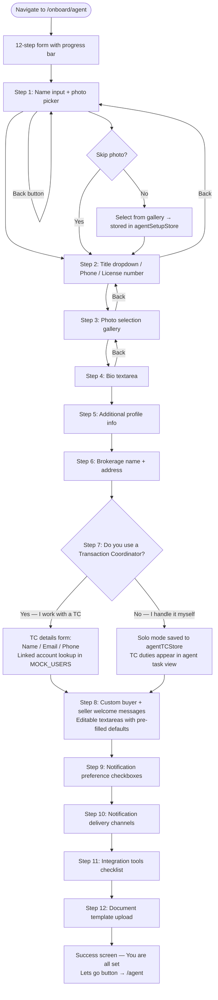

### 2E. Invite Client — InviteModal

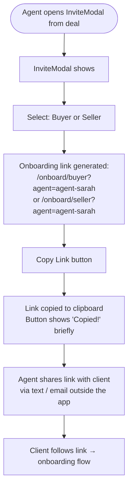

### 2F. Settings (`/agent/settings`)

```mermaid
flowchart TD
    START([/agent/settings]) --> TABS[Tab bar: Profile / TC / My Vendors / Documents / Notifications / Integrations]

    TABS --> PROFILE_T[Profile tab]
    PROFILE_T --> PROF_FIELDS[Editable: Name / Phone / Title / License / Bio]
    PROF_FIELDS --> SAVE_PROF[Save button → 'Saved ✓' confirmation]
    PROF_FIELDS --> EMAIL_NOTE[Email field — read-only\nNote: managed by admin]

    TABS --> TC_T[Transaction Coordinator tab]
    TC_T --> TC_CURRENT{TC currently set?}
    TC_CURRENT -->|Yes| TC_CARD[Shows TC card: name / email / phone\nEdit and Remove TC buttons]
    TC_CARD --> TC_EDIT[Edit form opens inline]
    TC_EDIT --> TC_SAVE[Save TC → stored in agentTCStore]
    TC_CARD --> TC_REMOVE[Remove TC button → confirmation prompt]
    TC_REMOVE --> TC_CONFIRM{Confirm?}
    TC_CONFIRM -->|Yes| TC_CLEARED[TC removed]
    TC_CONFIRM -->|No| TC_CARD
    TC_CURRENT -->|No| TC_EMPTY[Empty state + edit form\nAdd TC info → Save]
    TC_EMPTY --> TC_SAVE

    TABS --> VENDORS_T[My Vendors tab]
    VENDORS_T --> VENDOR_CATS[Collapsible categories:\nInspector / Title / Insurance / Lender / etc.]
    VENDOR_CATS --> VENDOR_ITEM{Vendor actions}
    VENDOR_ITEM -->|Star button| FEATURED[Toggle featured / unfeatured]
    VENDOR_ITEM -->|Up/Down arrows| REORDER[Reorder within category]
    VENDOR_ITEM -->|Pencil| EDIT_V[Open edit modal\nPre-fills all fields]
    VENDOR_ITEM -->|Trash| DELETE_V[Delete with confirmation]
    DELETE_V --> DEL_CONFIRM{Confirm?}
    DEL_CONFIRM -->|Yes| VENDOR_GONE[Vendor removed from list\n+ removed from client portals]
    DEL_CONFIRM -->|No| VENDOR_CATS
    VENDOR_CATS --> ADD_V[Add vendor button per category]
    ADD_V --> ADD_MODAL[Modal: Company required / Contact / Phone\nEmail / Website / Notes / Featured toggle]
    ADD_MODAL --> SAVE_V{Save}
    SAVE_V -->|Company missing| BLOCKED_V[Save button disabled]
    SAVE_V -->|Valid| VENDOR_SAVED[Vendor saved → appears in\nclient portals under Preferred Vendors]
    VENDOR_SAVED --> VENDOR_CATS

    TABS --> DOCS_T[Documents tab]
    DOCS_T --> DOC_TEMPLATE[Document template list]
    DOC_TEMPLATE --> ADD_TEMPLATE[Add template button]
    ADD_TEMPLATE --> TEMPLATE_FORM[Inline form: Type dropdown / Display name / Notes / Simulate Upload]
    TEMPLATE_FORM --> UPLOAD_SIM[Simulate upload → shows filename]
    TEMPLATE_FORM --> SAVE_TEMPLATE[Add button → template stored]
    TEMPLATE_FORM --> CANCEL_T[Cancel → form collapses]
    DOC_TEMPLATE --> TEMPLATE_ACTIONS{Template actions}
    TEMPLATE_ACTIONS -->|Pencil| EDIT_TEMPLATE[Edit inline]
    TEMPLATE_ACTIONS -->|Trash| DELETE_TEMPLATE[Delete with confirmation]

    TABS --> NOTIF_T[Notifications tab]
    NOTIF_T --> TOGGLES[Toggle switches per notification type:\nDeal changes / Tasks / Overdue / Fast Pass\nDisclosures / Messages / Email / Push/SMS]
    TOGGLES --> SAVED_AUTO[State updates immediately on toggle]

    TABS --> INTEGRATIONS_T[Integrations tab]
    INTEGRATIONS_T --> INT_CARDS[DocuSign / Google Calendar / Outlook:\nConnect buttons — no flow yet\nARIVE: shows Connected if Mountain Mortgage\nStripe: Coming in v2 teaser]
```

---

## 3. Buyer Onboarding (`/onboard/buyer`)

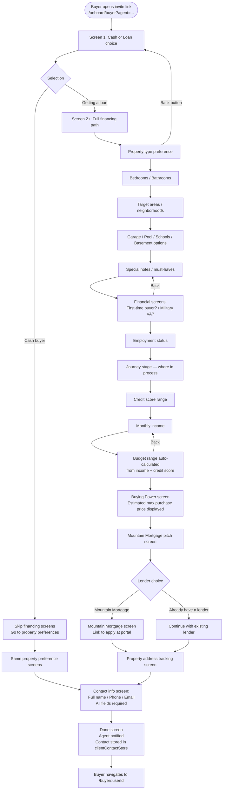

---

## 4. Buyer — Kevin Chen / Chris Davis (Intake)

Both buyers are at Intake, new to the system. Same flow applies.

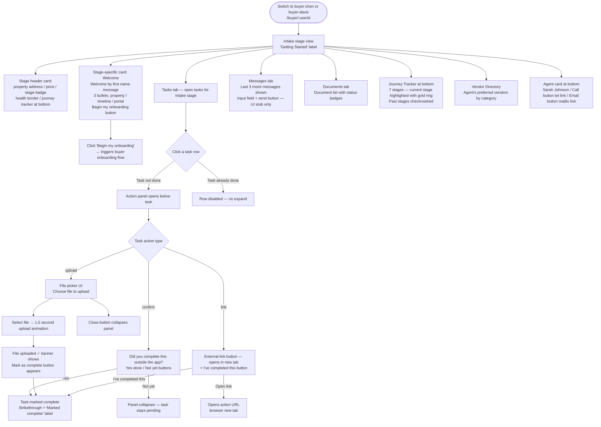

---

## 5. Buyer — Alex Garcia (Active Search)

deal-garcia | Active Search | Mountain Mortgage pre-approval in progress

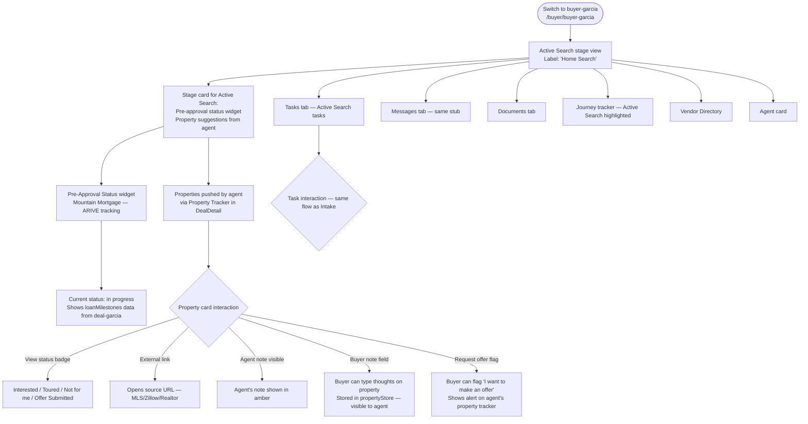

---

## 6. Buyer — Mike Smith (Under Contract + Fast Pass)

deal-smith | Under Contract | Health: Yellow | Fast Pass enrolled | Disclosures: NOT SIGNED

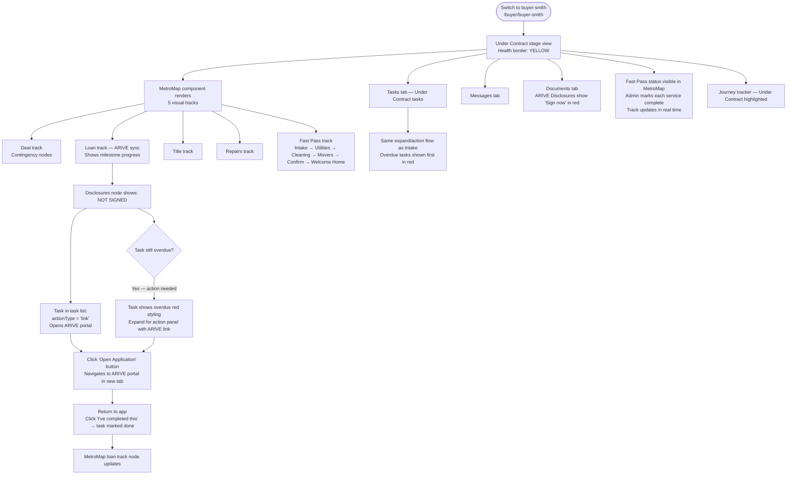

---

## 7. Seller Onboarding (`/onboard/seller`)

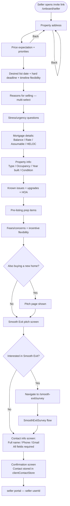

---

## 8. Smooth Exit Flow (`/smooth-exit` + `/smooth-exit/survey`)

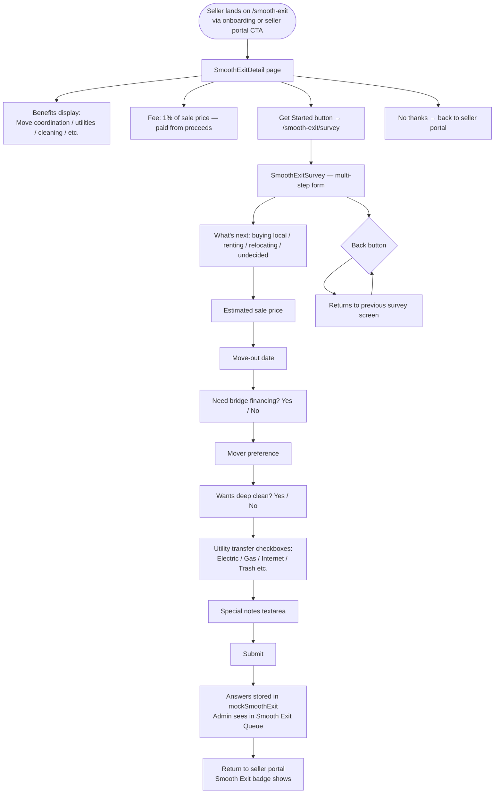

---

## 9. Fast Pass Flow (`/fast-pass` + `/fast-pass/survey`)

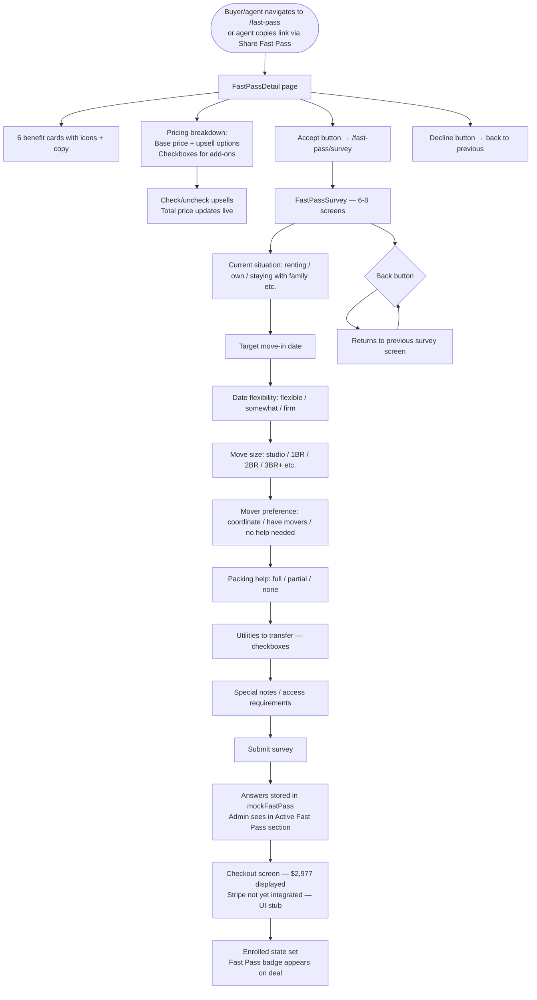

---

## 10. Seller — Robert Johnson (Offer Active)

deal-johnson | Offer Active | ASAP timeline | Also buying

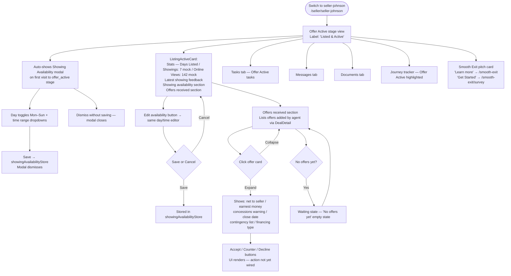

---

## 11. Seller — Jennifer Williams (Under Contract + Smooth Exit + Repair Request)

deal-williams | Under Contract | Health: RED | repair_request flag | Smooth Exit enrolled

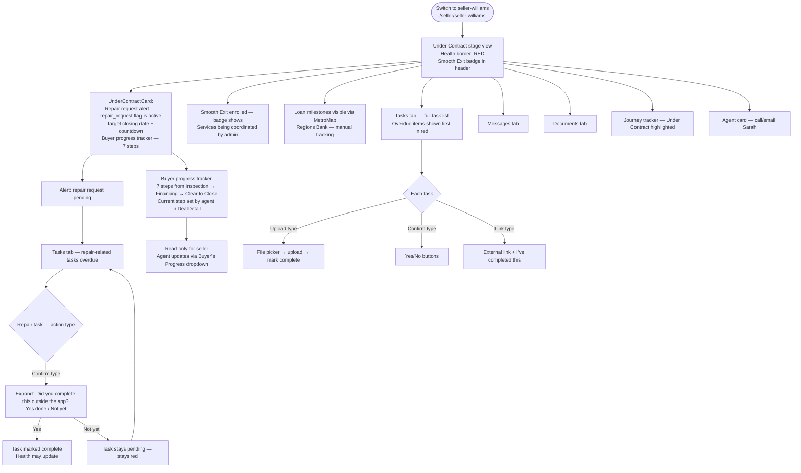

---

## 12. TC — Jamie Taylor

Assigned to: deal-smith + deal-williams

```mermaid
flowchart TD
    START([Switch to tc-taylor\n/tc]) --> TC_DASH[TC Dashboard]

    TC_DASH --> NAV[Section navigation via URL]
    NAV --> OV_URL[tc — Overview]
    NAV --> DOC_URL[tc/documents — Documents]
    NAV --> DISC_URL[tc/disclosures — Loan Milestones]
    NAV --> CHECK_URL[tc/checklists — Checklists]
    NAV --> CAL_URL[tc/calendar — Calendar]
    NAV --> MSG_URL[tc/messages — Contacts]

    OV_URL --> VIEW_SWITCHER[View switcher dropdown:\nMy Transactions / Contingencies / Deadlines]

    VIEW_SWITCHER --> MY_TX[My Transactions view]
    MY_TX --> STATS_TC[Stats bar: Active Files / Overdue Tasks\nUrgent Contingencies / Closing This Month]
    MY_TX --> ALERTS_TC[Critical deal alert if red deals exist\nUrgent contingency alert if expiring ≤5 days]
    MY_TX --> DEAL_CARDS_TC[Deal cards — deal-smith + deal-williams\nEach shows: client / health / stage / task count\ncontingency count / closing date countdown]
    DEAL_CARDS_TC --> CLICK_DEAL_TC[Click card → /tc/deals/:dealId]

    VIEW_SWITCHER --> CONTINGENCIES_V[Contingencies view]
    CONTINGENCIES_V --> CONT_BY_DEAL[Grouped by deal\nEach contingency: type / status / deadline]
    CONT_BY_DEAL --> CONT_ACTIONS{Contingency action}
    CONT_ACTIONS -->|Mark Waived| WAIVED[Status → waived / turns green]
    CONT_ACTIONS -->|Remove| REMOVED_C[Status → removed / turns gray]
    WAIVED --> CONT_BY_DEAL
    REMOVED_C --> CONT_BY_DEAL
    CONT_ACTIONS -->|Neither| CONT_STATUS[Active status — amber — deadline counting down]

    VIEW_SWITCHER --> DEADLINES_V[Deadlines view]
    DEADLINES_V --> DEADLINE_GROUPS[Grouped: Overdue / Today / Next 7 Days / Upcoming]
    DEADLINE_GROUPS --> DEADLINE_ITEM[Each item: icon / title / source badge\nclient name / stage / days until due / assignee]

    DISC_URL --> MILESTONES_TC[Loan Milestones — by deal]
    MILESTONES_TC --> MILESTONE_CARD{Milestone card type}
    MILESTONE_CARD -->|ARIVE synced badge| ARIVE_RO_TC[All 6 toggles disabled — read-only\nSend Reminder button if disclosures pending]
    ARIVE_RO_TC --> REMIND_BTN[Send Reminder button — UI present\nAction stub]
    MILESTONE_CARD -->|Manual badge| MANUAL_TC[All 6 toggles clickable by TC\nAppraisal dropdown editable\nCTC + Funded shown when applicable]
    MANUAL_TC --> TOGGLE_TC[Click toggle → checkbox updates\nProgress bar recalculates]

    CHECK_URL --> CHECKLISTS_TC[Checklists — by deal]
    CHECKLISTS_TC --> ELIGIBLE{Deal stage ≥ Under Contract?}
    ELIGIBLE -->|Yes| FULL_CHECKLIST[Full checklist card:\nGrouped by: Contract / Loan / Title / Closing\nEach item: checkbox / label / assignee dropdown / due date]
    FULL_CHECKLIST --> ITEM_ACTIONS{Item actions}
    ITEM_ACTIONS -->|Click checkbox| TOGGLE_ITEM[Item marked done/undone\nProgress bar updates]
    ITEM_ACTIONS -->|Assignee dropdown| REASSIGN_ITEM[Change assignee — permission checked]
    ITEM_ACTIONS -->|Due date picker| SET_DUE[Set/change due date]
    ITEM_ACTIONS -->|Delete button| DELETE_ITEM[Remove item]
    FULL_CHECKLIST --> ADD_ITEM[Add item button per category]
    ADD_ITEM --> NEW_ITEM[New row with label input + save]
    FULL_CHECKLIST --> ADD_CATEGORY[Add custom category + items]
    ELIGIBLE -->|No| LOCKED_CHECK[Locked card: 'Available at Under Contract']

    CAL_URL --> CALENDAR_TC[Calendar events list]
    CALENDAR_TC --> EVENT_GROUPS[Grouped: Past/Overdue / Today / Next 7 Days\nNext 2 Weeks / This Month]
    EVENT_GROUPS --> EVENT_ITEM[Each event: icon / title / client / days until\nevent type badge — Closing/Contingency/Task]

    MSG_URL --> CONTACTS_TC[Contacts — by deal]
    CONTACTS_TC --> CONTACT_CARD[For each deal:\nEach party: role / name / company\nCall button tel link / Email copies to clipboard]

    DOC_URL --> DOCS_TC[Documents — by deal]
    DOCS_TC --> DOC_ITEM_TC{Document action}
    DOC_ITEM_TC -->|Request| REQUEST_DOC_TC[Request button — stub]
    DOC_ITEM_TC -->|Send Reminder| REMINDER_TC[Send Reminder button — stub]
    DOC_ITEM_TC -->|Mark OK| MARK_OK_TC[Mark as received — stub]
```

---

## 13. Admin — Paul Leara

```mermaid
flowchart TD
    START([Switch to admin-paul\n/admin]) --> ADMIN_DASH[Admin Dashboard]

    ADMIN_DASH --> SIDE_NAV[Left sidebar navigation:\n13 sections]

    SIDE_NAV --> PIPELINE_ADM[Pipeline Overview — default]
    PIPELINE_ADM --> STATS_ADM[8-tile stats bar:\nTotal Value / Active Deals / Commission\nOverdue Tasks / Pending Disclosures\nClosing ≤30d / Active Fast Pass / Agents]
    PIPELINE_ADM --> NEEDS_ATTN[Needs Attention:\nRed deals → Williams shown with health badge\nYellow + overdue tasks]
    PIPELINE_ADM --> BY_STAGE[Deals by Stage rows:\nCompact table — client / property / type / stage / health / agent / tasks]
    PIPELINE_ADM --> BY_AGENT[By Agent cards:\nSarah — health dot counts / commission / overdue indicator]

    SIDE_NAV --> ALL_DEALS[All Deals section\nFull table — all 6 deals\nSort-on-hover / links to deal detail]

    SIDE_NAV --> DISCLOSURES[Pending Disclosures\nAlert rows: client / property / health / stage\nSend Reminder button per row — stub]

    SIDE_NAV --> PREAPPROVAL[Pre-Approval Queue\nDeals with mountain_mortgage flag\nClient / current task / stage / target price]

    SIDE_NAV --> STUCK[Stuck Deals\nDeals in current stage 14+ days\nDays-in-stage shown as large number]

    SIDE_NAV --> FEES[Fees Collected\nCollected vs. Pipeline commission totals\nFull commission table with breakdown]

    SIDE_NAV --> FP_ADM[Active Fast Pass section]
    FP_ADM --> FP_SECTIONS_ADM[Three sections:\nPending Payment / Active / No Enrollment]
    FP_SECTIONS_ADM --> FP_DEAL_ADM[For each enrolled deal:\nClient / property / status badge / amount paid\nSelected upsells list / survey snapshot\nTask progress bar]
    FP_DEAL_ADM --> MARK_PAID[Mark Paid button — pending payment only]
    MARK_PAID --> PAID_DONE[Status updates to active]
    FP_DEAL_ADM --> TASK_PROG[Progress bar — admin completes tasks externally\nBar reflects % of services done]

    SIDE_NAV --> SE_ADM[Smooth Exit Queue]
    SE_ADM --> SE_SECTIONS_ADM[Pending Activation / Active]
    SE_SECTIONS_ADM --> SE_DEAL_ADM[Client / property / status / fee 1 pct of sale\nBuy Before Sell badge if applicable\nSurvey snapshot: next step / move-out date]
    SE_DEAL_ADM --> ACTIVATE_BTN[Activate button — pending only]
    ACTIVATE_BTN --> SE_ACTIVATED[Status → active]

    SIDE_NAV --> ARIVE_ADM[ARIVE Status\nAll deals with loan milestone data]
    ARIVE_ADM --> ARIVE_DEAL_ROW[For each deal:\nclient / property / stage / completion pct\n6-item milestone checklist — visual display only\nAppraisal status badge / Funded badge]

    SIDE_NAV --> USERS_ADM[User Management]
    USERS_ADM --> USER_STATS_ADM[4 stat cards: Agent / TC / Buyer / Seller counts]
    USERS_ADM --> USER_TABLES[Tables grouped by role]
    USER_TABLES --> USER_ROW_ADM{User row actions}
    USER_ROW_ADM -->|View Deals| VIEW_DEALS_ADM[Button — stub]
    USER_ROW_ADM -->|Deactivate| DEACT_ADM[Deactivate button — stub]
    USERS_ADM --> INVITE_USER_ADM[Invite User — dashed button at bottom\nStub]

    SIDE_NAV --> COMING_SOON_ADM[Metro View / Promotions / Config\n→ Coming Soon page]

    SIDE_NAV --> ADMIN_SETTINGS[admin/settings → same Settings page\nwith agent/admin tabs]
```

---

## 14. Error State Reference — What's Actually in the Code

| Scenario | What the UI does | How to continue |
|----------|-----------------|-----------------|
| Task is overdue | Row turns red / overdue badge / sorted to top | Expand task → use action panel (confirm/upload/link) to mark complete |
| Task has upload action | File picker renders in expand panel | Select file → 1.5s animation → Upload success → Mark complete |
| Task has link action | External link button + 'I've completed this' | Click link → do the thing externally → return → click completed |
| Deal health is Red (Williams) | Red border on header card / alert in Admin | Agent/TC addresses underlying tasks or flags — health badge is visual only, no auto-block |
| ARIVE milestones read-only | All toggles disabled — ARIVE badge shown | Manual updates not possible — reflects ARIVE state only |
| Manual milestones — CTC reached | 'Mark as Funded' button appears | Click → Funded=true → confetti celebration fires |
| No offers added yet (seller view) | Empty state: 'No offers yet' | Agent adds offers via DealDetail → Offers card |
| Showing availability not set (offer_active) | Auto-modal fires on first visit | Set availability → Save → modal dismisses |
| Buyer requests offer on property | Star alert banner on agent's property row | Agent initiates offer outside app — no direct flow yet |
| Smooth Exit survey abandoned | Progress lost (in-memory store) | Re-enter /smooth-exit/survey and start over |
| Fast Pass survey abandoned | Progress lost (in-memory store) | Re-enter /fast-pass/survey and start over |
| Contingency overdue (TC view) | Amber alert banner + red badge on deadline | TC marks Waived or Removed in Contingencies view |
| Net sheet negative (red) | Net proceeds shows in red | Agent adjusts fields — e.g. lower mortgage payoff — recalculates live |
| Messages input | Input and button render — no send | Known stub — backend messaging not yet integrated |
| Offer Accept/Counter/Decline | Buttons render — no state change | Known stub — offer decision flow not yet implemented |
| Stage advance | Stage changes in dealStageStore — all views update | No checklist gate in the prototype — advance is always available |
